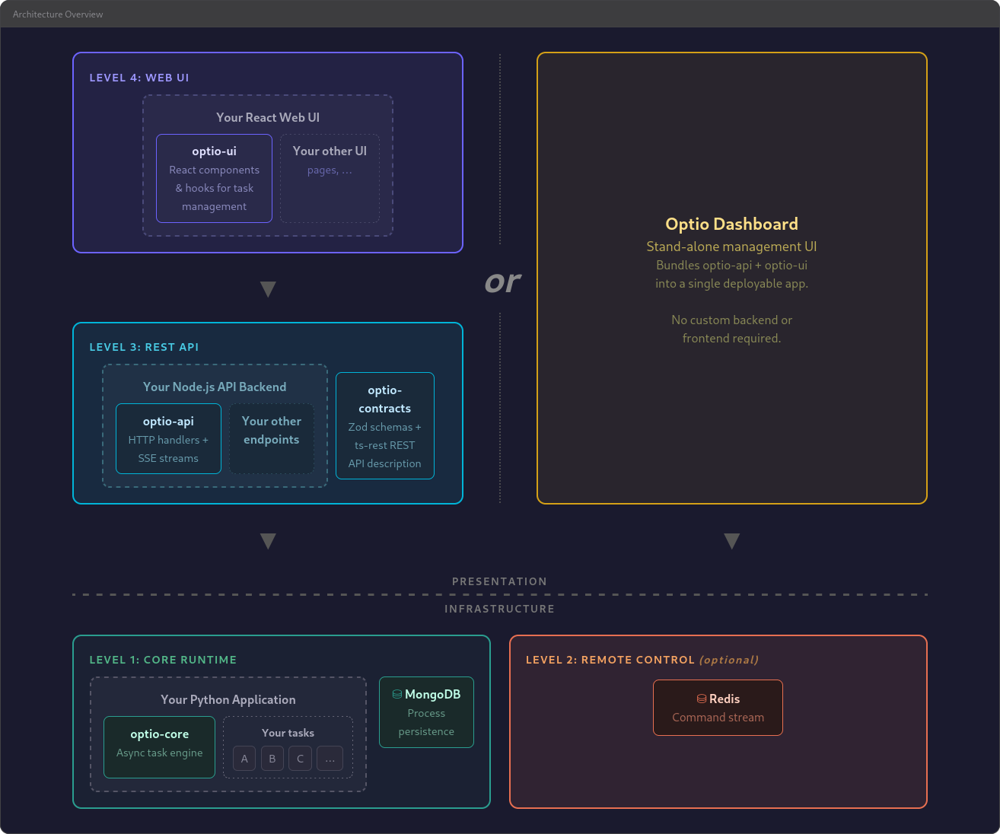

<p align="center">
  <a href="#overview">Overview</a> •
  <a href="#architecture">Architecture</a> •
  <a href="#key-concepts">Key Concepts</a> •
  <a href="#features">Features</a> •
  <a href="#your-options-for-deployment-and-integration">Deployment & Integration</a> •
  <a href="#packages">Packages</a>
</p>

# Optio

*In the Roman army, the **optio** was the centurion's second-in-command — responsible for scheduling daily routines, managing operations, and ensuring everything ran smoothly behind the scenes. This library serves the same role for your application: scheduling and managing background processes, tracking their lifecycle, and keeping everything under control.*

## Overview

Optio is process management framework, built around [optio-core](packages/optio-core), a library for Python. It provides a framework for defining, launching, cancelling, and monitoring long-running tasks backed by MongoDB for persistence.

Optio is designed as a progressive stack: you start simple with just Python and MongoDB ([optio-core](packages/optio-core)), then add layers as your needs grow — Redis for remote control, a REST API ([optio-api](packages/optio-api)) for HTTP access, and a React UI ([optio-ui](packages/optio-ui)) for monitoring. Each level adds capability (and a dependency), but you only adopt what you need.

## Architecture



## Key Concepts

### Process State Machine

Every process follows a strict state machine. The happy path is straightforward:

```
idle --> scheduled --> running --> done
                          |         |
                          v         v
                        failed    idle (dismiss)
                          |
                          v
                        idle (dismiss)

Cancel path:
  scheduled --> cancelled
  running --> cancel_requested --> cancelling --> cancelled
  cancelled --> idle (dismiss)
```

Here is the full state diagram, including re-launch and dismiss transitions:


States are grouped for convenience:

| Group | States | Description |
|-------|--------|-------------|
| Active | `scheduled`, `running`, `cancel_requested`, `cancelling` | Process is in progress |
| End | `done`, `failed`, `cancelled` | Terminal states from a run |
| Launchable | `idle`, `done`, `failed`, `cancelled` | Can be (re-)launched |
| Cancellable | `scheduled`, `running` | Can receive a cancel request |
| Dismissable | `done`, `failed`, `cancelled` | Can be reset to `idle` |

### Task Definitions

Inside your Python code, you define tasks as `TaskInstance` objects. Each one pairs an async function to execute (your application logic) with metadata that Optio uses to manage it — a unique ID, a display name, optional parameters, scheduling rules, and cancellation behavior. This is the main point of contact between your application and Optio: you provide the work and its description, Optio handles the rest.

Rather than registering tasks imperatively, you provide a `get_task_definitions` async callback that returns the full list of tasks. Optio calls this function on `init()` and on every `resync()`, syncing the returned list with MongoDB: new tasks are created, removed ones deleted, metadata updated — without disturbing running state.

```python
async def get_tasks(services):
    sources = await services["db"].sources.find().to_list(None)
    return [
        TaskInstance(
            execute=fetch_source,
            process_id=f"fetch-{s['_id']}",
            name=f"Fetch {s['name']}",
            params={"source_id": str(s["_id"])},
            metadata={"targetId": str(s["_id"])},
            schedule="0 */6 * * *",  # Every 6 hours
        )
        for s in sources
    ]
```

### ProcessContext

Every task `execute` function receives a single `ProcessContext` argument — the task's interface to Optio:

- **`ctx.process_id`** — The process ID string
- **`ctx.params`** — The params dict from the task definition
- **`ctx.metadata`** — The metadata dict from the task definition
- **`ctx.services`** — The services dict passed to `init()`
- **`ctx.report_progress(percent, message)`** — Update progress (percent 0-100, throttled writes to MongoDB)
- **`ctx.should_continue()`** — Returns `False` if cancellation was requested
- **`ctx.run_child(...)`** — Run a sequential child process
- **`ctx.parallel_group(...)`** — Create a parallel execution group
- **`ctx.mark_ephemeral()`** — Mark this process for deletion after completion

### Child Processes

Tasks can spawn child processes that appear as a tree in the database. Children have their own state, progress, and logs. Sequential children are created with `ctx.run_child()`, while parallel execution groups are created with `ctx.parallel_group()` for concurrent work with configurable concurrency limits.

### Cooperative Cancellation

Cancellation is cooperative. When a cancel request arrives, the process transitions to `cancel_requested` then `cancelling`, and an internal flag is set. The task function must check `ctx.should_continue()` periodically and return early if it is `False`. Cancellation propagates to child processes automatically.

## Features

- Async task execution with MongoDB-backed persistence
- Hierarchical parent-child process trees (sequential and parallel)
- Cooperative cancellation with propagation control
- Progress reporting with throttled database writes
- Cron scheduling via APScheduler
- Dynamic ad-hoc process creation
- Optional Redis integration for remote command ingestion
- REST API with SSE streams for real-time updates
- Pre-built React components for process monitoring

## Your Options for Deployment and Integration

The core of Optio is the Python library. This is the essential part; you can pick and choose the rest based on your requirements. Below we showcase the possible combinations of components that can work together.

### Level 1: Core Runtime (Python + MongoDB)

Define async tasks, launch/cancel/dismiss them, track progress, create child processes, cron scheduling, and query processes — all via direct Python method calls.

**Requirements:** Python 3.11+, MongoDB

```bash
pip install optio-core
```

```python
import asyncio
from motor.motor_asyncio import AsyncIOMotorClient
from optio_core import init, launch_and_wait, get_process, TaskInstance

async def my_task(ctx):
    for i in range(10):
        if not ctx.should_continue():
            return
        ctx.report_progress(i * 10, f"Step {i + 1}/10")
        await asyncio.sleep(1)
    ctx.report_progress(100, "Done")

async def get_tasks(services):
    return [
        TaskInstance(
            execute=my_task,
            process_id="my-task",
            name="My Task",
        ),
    ]

async def main():
    client = AsyncIOMotorClient("mongodb://localhost:27017")
    db = client["myapp"]

    await init(
        mongo_db=db,
        get_task_definitions=get_tasks,
    )

    await launch_and_wait("my-task")
    proc = await get_process("my-task")
    print(proc["status"]["state"])  # "done"

asyncio.run(main())
```

### Level 2: Remote Control (+ Redis)

Adds external command ingestion via Redis Streams, enabling remote control of processes from other services. External systems can publish commands (launch, cancel, dismiss, resync, or custom) to the `optio:commands` Redis stream (customizable via the `prefix` parameter). Custom command handlers can be registered with `on_command()`.

```bash
pip install optio-core[redis]
```

### Level 3: REST API (+ [optio-api](packages/optio-api))

Adds HTTP endpoints to your Node.js API server for process management and SSE streams for real-time status updates. Built on ts-rest contracts for type-safe client-server communication.

```bash
npm install optio-api
```

### Level 4: Web UI (+ [optio-ui](packages/optio-ui))

Adds pre-built React components for process monitoring to your React web app: process list, tree view, progress bars, and action buttons.

<!-- TODO: Add UI screenshot here when available -->

```bash
npm install optio-ui
```

### The no-code dashboard alternative: [optio-dashboard](packages/optio-dashboard)

If you don't need to embed Optio into an existing application, [optio-dashboard](packages/optio-dashboard) bundles [optio-api](packages/optio-api) and [optio-ui](packages/optio-ui) into a standalone app you can run directly — no custom backend or frontend code required. Just point it at your MongoDB and Redis instances and you have a full management UI.

```bash
npx optio-dashboard
```

Configuration is handled entirely through environment variables (`MONGODB_URL`, `REDIS_URL`, `PORT`). An optional `OPTIO_PREFIX` variable overrides the default namespace if needed. If you later need custom API endpoints or custom UI components, you can switch to using [optio-api](packages/optio-api) and [optio-ui](packages/optio-ui) directly.

## Packages

| Package | Description | Docs |
|---------|-------------|------|
| **[optio-core](packages/optio-core)** | Python async task runtime — the core engine | [`README`](packages/optio-core/README.md) |
| **[optio-contracts](packages/optio-contracts)** | Zod schemas + ts-rest API contract | [`README`](packages/optio-contracts/README.md) |
| **[optio-api](packages/optio-api)** | Node.js REST API handlers + SSE streams | [`README`](packages/optio-api/README.md) |
| **[optio-ui](packages/optio-ui)** | React components & hooks for monitoring | [`README`](packages/optio-ui/README.md) |
| **[optio-dashboard](packages/optio-dashboard)** | Standalone management UI — no code required | [`README`](packages/optio-dashboard/README.md) |
