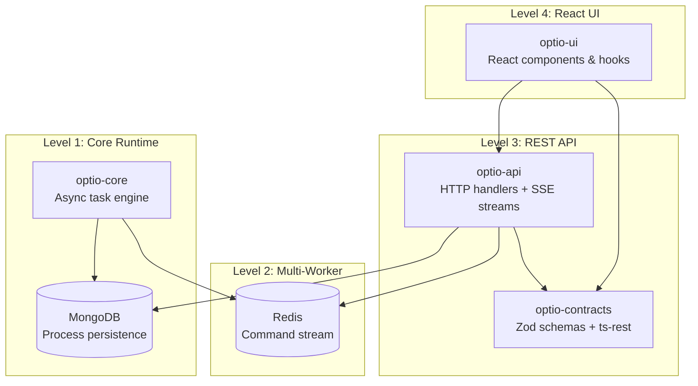
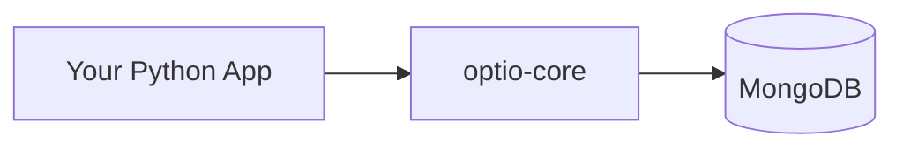
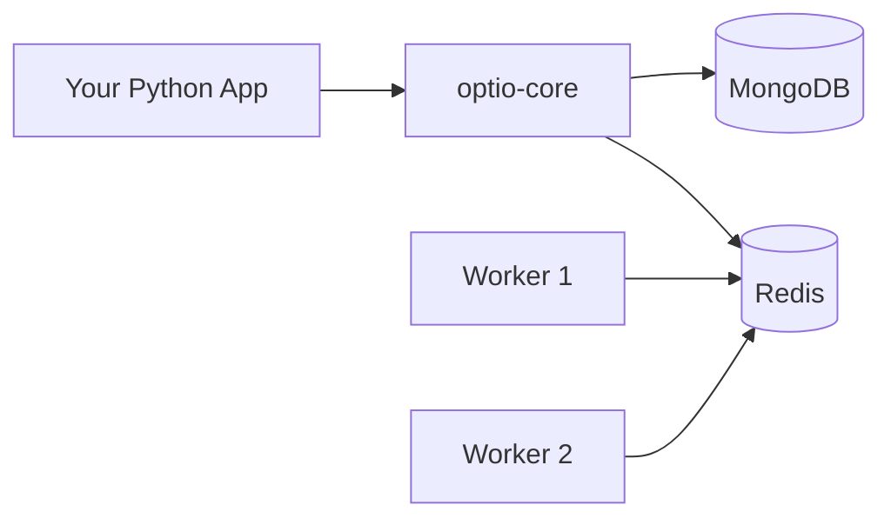
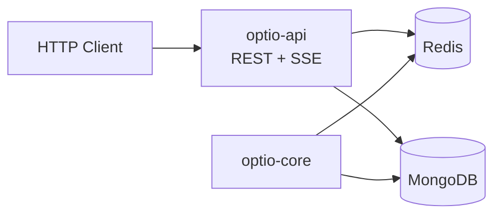
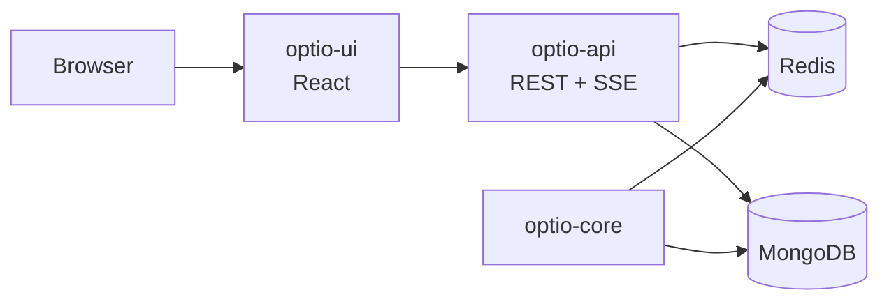

# Documentation Housekeeping Implementation Plan

> **For agentic workers:** REQUIRED SUB-SKILL: Use superpowers:subagent-driven-development (recommended) or superpowers:executing-plans to implement this plan task-by-task. Steps use checkbox (`- [ ]`) syntax for tracking.

**Goal:** Restructure Optio's documentation — rewrite root README as an overview with images, move API docs to per-package READMEs, update AGENTS.md.

**Architecture:** Root README becomes a high-level overview (concepts, features, deployment levels, diagrams). Detailed API reference lives in per-package READMEs. Images stored in `docs/images/`.

**Tech Stack:** Markdown, Mermaid (for diagrams)

---

## File Structure

| File | Action | Responsibility |
|------|--------|----------------|
| `README.md` | Rewrite | Overview, concepts, features, deployment levels, quick start |
| `packages/optio-core/README.md` | Rewrite | Python API reference (from root README) |
| `packages/optio-contracts/README.md` | Edit | Add implementation-detail note at top |
| `packages/optio-api/README.md` | Edit | Light edits for standalone reading |
| `packages/optio-ui/README.md` | Edit | Add screenshot placeholder |
| `AGENTS.md` | Edit | Fix stale references |
| `docs/images/architecture.mmd` | Create | Mermaid source for architecture diagram |
| `docs/images/level-1.mmd` | Create | Mermaid source for Level 1 deployment |
| `docs/images/level-2.mmd` | Create | Mermaid source for Level 2 deployment |
| `docs/images/level-3.mmd` | Create | Mermaid source for Level 3 deployment |
| `docs/images/level-4.mmd` | Create | Mermaid source for Level 4 deployment |

Note: Mermaid diagrams will be embedded directly in the README using GitHub's native Mermaid rendering (` ```mermaid ` code blocks). The `.mmd` source files are kept in `docs/images/` as standalone sources for SVG rendering later if needed.

Note: The banner image (AI-generated Roman centurion) and UI screenshot require external tooling and are deferred. The README will reference `docs/images/banner.png` and `docs/images/ui-screenshot.png` but these files won't exist yet — the image references will be added when the images are available.

---

### Task 1: Create Mermaid diagram sources

**Files:**
- Create: `docs/images/architecture.mmd`
- Create: `docs/images/level-1.mmd`
- Create: `docs/images/level-2.mmd`
- Create: `docs/images/level-3.mmd`
- Create: `docs/images/level-4.mmd`

- [ ] **Step 1: Create docs/images directory**

```bash
mkdir -p docs/images
```

- [ ] **Step 2: Create architecture.mmd**

This shows the 4-layer progressive stack.



Write this to `docs/images/architecture.mmd`.

- [ ] **Step 3: Create level-1.mmd**



Write to `docs/images/level-1.mmd`.

- [ ] **Step 4: Create level-2.mmd**



Write to `docs/images/level-2.mmd`.

- [ ] **Step 5: Create level-3.mmd**



Write to `docs/images/level-3.mmd`.

- [ ] **Step 6: Create level-4.mmd**



Write to `docs/images/level-4.mmd`.

- [ ] **Step 7: Commit**

```bash
git add docs/images/
git commit -m "docs: add Mermaid diagram sources for architecture and deployment levels"
```

---

### Task 2: Rewrite root README.md

**Files:**
- Rewrite: `README.md`

- [ ] **Step 1: Write the new README.md**

Replace the entire file with the following structure. The content below is the complete file:

```markdown
# Optio

*In the Roman army, the **optio** was the centurion's second-in-command — responsible for scheduling daily routines, managing operations, and ensuring everything ran smoothly behind the scenes. This library serves the same role for your application: scheduling and managing background processes, tracking their lifecycle, and keeping everything under control.*

## Overview

Optio is a reusable async process management library. It provides a framework for defining, launching, cancelling, and monitoring long-running tasks with support for hierarchical parent-child relationships, progress reporting, cooperative cancellation, cron scheduling, and ad-hoc dynamic task creation.

Optio is designed as a **progressive stack**. Start with just the Python core and MongoDB, then add layers as your needs grow:


## Key Concepts

### Processes and the State Machine

Every process follows a strict state machine:

| State | Description |
|-------|-------------|
| `idle` | Initial state, ready to launch |
| `scheduled` | Queued for execution |
| `running` | Execute function is running |
| `done` | Completed successfully |
| `failed` | Execute function raised an exception |
| `cancel_requested` | Cancel requested, awaiting acknowledgement |
| `cancelling` | Acknowledged, cleaning up |
| `cancelled` | Cancelled successfully |

Processes in terminal states (`done`, `failed`, `cancelled`) can be re-launched or dismissed back to `idle`.

### Task Definitions

Tasks are defined via an async callback that returns the full list of `TaskInstance` objects. Optio calls this on startup and on every resync, automatically syncing with MongoDB: new tasks are created, removed ones deleted, metadata updated — without disturbing running state.

```python
async def get_tasks(services):
    sources = await services["db"].sources.find().to_list(None)
    return [
        TaskInstance(
            execute=fetch_source,
            process_id=f"fetch-{s['_id']}",
            name=f"Fetch {s['name']}",
            schedule="0 */6 * * *",
        )
        for s in sources
    ]
```

### ProcessContext

Every task receives a `ProcessContext` — its interface to Optio:

- **Progress:** `ctx.report_progress(percent, message)` — throttled writes to MongoDB
- **Cancellation:** `ctx.should_continue()` — cooperative polling; return early when `False`
- **Child processes:** `ctx.run_child(...)` for sequential, `ctx.parallel_group(...)` for parallel
- **Services:** `ctx.services` — application-provided dependencies

### Child Processes

Tasks can spawn child processes that form a tree in the database. Children have independent state, progress, and logs. Sequential children block until complete; parallel children run concurrently with configurable concurrency limits.

### Cooperative Cancellation

Cancellation is cooperative. When a cancel request arrives, an internal flag is set. The task must check `ctx.should_continue()` periodically and return early. Cancellation propagates to child processes automatically.

## Features

- Async-first (asyncio) with MongoDB persistence
- Strict state machine with well-defined transitions
- Hierarchical parent-child processes (sequential and parallel)
- Progress reporting with throttled database writes
- Cooperative cancellation with configurable propagation
- Cron scheduling via APScheduler
- Ad-hoc process creation at runtime
- Ephemeral processes (auto-cleanup after completion)
- Optional Redis for multi-worker command ingestion
- Type-safe REST API with SSE real-time streams
- Pre-built React UI components

## Deployment Levels

### Level 1: Python Core (MongoDB only)


Define async tasks, launch/cancel/dismiss them, track progress, create child processes, cron scheduling. All via direct Python method calls.

**Requirements:** Python 3.11+, MongoDB

```bash
pip install optio-core
```

```python
import asyncio
from motor.motor_asyncio import AsyncIOMotorClient
from optio_core import init, launch_and_wait, get_process, TaskInstance

async def my_task(ctx):
    for i in range(10):
        if not ctx.should_continue():
            return
        ctx.report_progress(i * 10, f"Step {i + 1}/10")
        await asyncio.sleep(1)
    ctx.report_progress(100, "Done")

async def get_tasks(services):
    return [TaskInstance(execute=my_task, process_id="my-task", name="My Task")]

async def main():
    client = AsyncIOMotorClient("mongodb://localhost:27017")
    await init(mongo_db=client["myapp"], prefix="myapp", get_task_definitions=get_tasks)
    await launch_and_wait("my-task")
    proc = await get_process("my-task")
    print(proc["status"]["state"])  # "done"

asyncio.run(main())
```

### Level 2: + Redis


Adds external command ingestion via Redis Streams, multi-worker support, and custom command handlers.

```bash
pip install optio-core[redis]
```

### Level 3: + REST API


Adds HTTP endpoints for process management and SSE streams for real-time status updates.

```bash
npm install optio-api optio-contracts
```

### Level 4: + React UI


Adds pre-built React components for process monitoring: process list, tree view, progress bars, log viewer, action buttons.

```bash
npm install optio-ui
```

<!-- TODO: Add UI screenshot here when available -->
<!--  -->

## Packages

| Package | Description | Docs |
|---------|-------------|------|
| [optio-core](packages/optio-core) | Python async task runtime — the core engine | [README](packages/optio-core/README.md) |
| [optio-contracts](packages/optio-contracts) | Zod schemas + ts-rest API contract | [README](packages/optio-contracts/README.md) |
| [optio-api](packages/optio-api) | REST API handlers + SSE streams | [README](packages/optio-api/README.md) |
| [optio-ui](packages/optio-ui) | React components & hooks for monitoring | [README](packages/optio-ui/README.md) |
```

- [ ] **Step 2: Review the new README for accuracy**

Read the file back and verify all package names, import paths, and code examples match the current codebase.

- [ ] **Step 3: Commit**

```bash
git add README.md
git commit -m "docs: rewrite root README as overview with concepts, features, and deployment levels"
```

---

### Task 3: Rewrite optio-core/README.md with Python API reference

**Files:**
- Rewrite: `packages/optio-core/README.md`

- [ ] **Step 1: Write the new README**

The content comes from the current root README's "Python API Reference" section (lines 400-649) and the AGENTS.md Python section. Combine into a standalone package README with:

1. Brief intro (what this package is)
2. Installation
3. Quick start example (reuse the Level 1 example from root README)
4. Lifecycle API (`init`, `run`, `shutdown`)
5. Process Management (`launch`, `launch_and_wait`, `cancel`, `dismiss`, `resync`)
6. Querying (`get_process`, `list_processes`)
7. Ad-hoc Processes (`adhoc_define`, `adhoc_delete`)
8. Custom Commands (`on_command`)
9. ProcessContext reference
10. Child Processes (sequential and parallel, with examples)
11. Progress Reporting and helpers
12. State Machine (states, groups, transitions)
13. Data Types (`TaskInstance`, `CancellationConfig`, `ChildResult`)
14. MongoDB Document Schema
15. Configuration (`OPTIO_PROGRESS_FLUSH_INTERVAL_MS`)

Copy the content from root README lines 400-649 (Python API Reference) and the Concepts section (lines 152-398). Reorganize for standalone reading — the reader should not need to consult the root README.

- [ ] **Step 2: Review for completeness**

Cross-check against AGENTS.md Python section to ensure nothing is missing.

- [ ] **Step 3: Commit**

```bash
git add packages/optio-core/README.md
git commit -m "docs: add full Python API reference to optio-core README"
```

---

### Task 4: Update optio-contracts/README.md

**Files:**
- Modify: `packages/optio-contracts/README.md`

- [ ] **Step 1: Add implementation-detail note**

Add a note after the title/intro, before the schema documentation:

> **Note:** This package is an implementation detail — it defines the API contract used for communication between `optio-ui` and `optio-api`. You only need to interact with this package directly if you are building an alternative frontend or a custom API adapter.

- [ ] **Step 2: Commit**

```bash
git add packages/optio-contracts/README.md
git commit -m "docs: clarify optio-contracts is an implementation detail"
```

---

### Task 5: Update optio-ui/README.md

**Files:**
- Modify: `packages/optio-ui/README.md`

- [ ] **Step 1: Add screenshot placeholder**

Add a screenshot placeholder near the top, after the intro paragraph:

```markdown
<!-- TODO: Add UI screenshot here when available -->
<!--  -->
```

- [ ] **Step 2: Commit**

```bash
git add packages/optio-ui/README.md
git commit -m "docs: add UI screenshot placeholder to optio-ui README"
```

---

### Task 6: Update AGENTS.md — fix stale references

**Files:**
- Modify: `AGENTS.md`

- [ ] **Step 1: Audit AGENTS.md against current codebase**

Read through AGENTS.md and verify:
- All import paths match actual module structure (e.g., `import optio_core` vs `from optio import ...`)
- Package names match (`optio-core` vs `optio`)
- File paths reference correct locations under `packages/`
- The Integration Levels table is accurate
- Function signatures match current source code

Cross-reference against:
- `packages/optio-core/src/optio_core/__init__.py` (exported symbols)
- `packages/optio-contracts/src/index.ts` (exported types)
- `packages/optio-api/src/index.ts` (exported functions)
- `packages/optio-ui/src/index.ts` (exported components/hooks)

- [ ] **Step 2: Fix any stale references found**

Apply edits to correct any mismatches found in Step 1.

- [ ] **Step 3: Commit**

```bash
git add AGENTS.md
git commit -m "docs: fix stale references in AGENTS.md after monorepo reorg"
```

---

### Task 7: Final review

- [ ] **Step 1: Read all modified files end-to-end**

Read each file in order and verify:
- No broken relative links between docs
- No duplicate content between root README and package READMEs
- Consistent terminology (e.g., "process" vs "task" usage)
- No references to old pre-monorepo paths

Files to read:
- `README.md`
- `packages/optio-core/README.md`
- `packages/optio-contracts/README.md`
- `packages/optio-api/README.md`
- `packages/optio-ui/README.md`
- `AGENTS.md`

- [ ] **Step 2: Fix any issues found**

- [ ] **Step 3: Commit if any fixes were needed**

```bash
git add -A
git commit -m "docs: fix issues found during final review"
```
