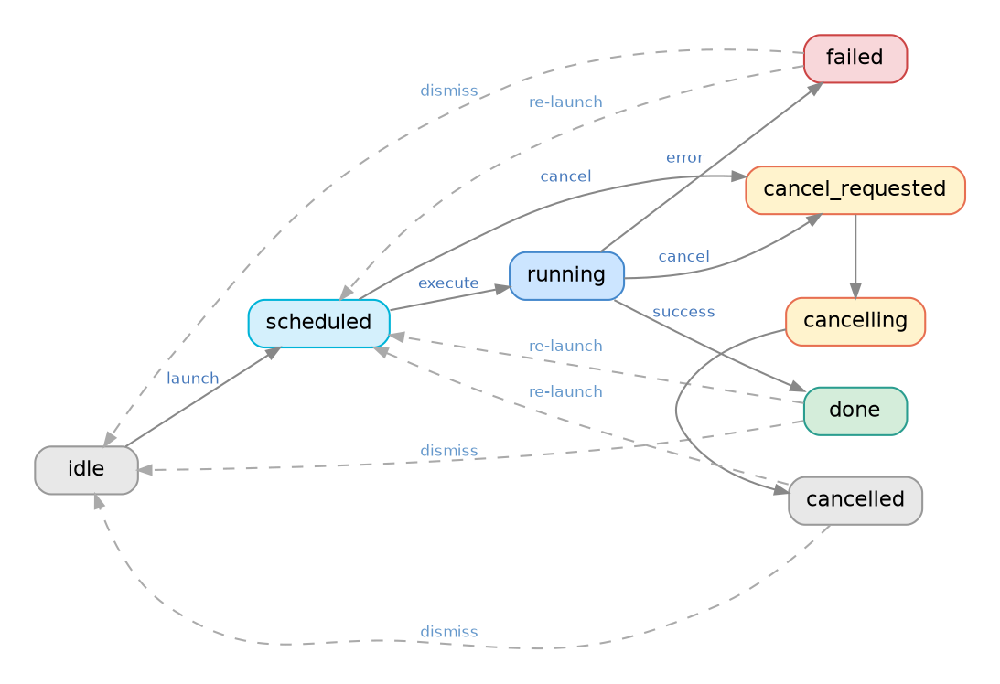

# optio-core

The core Python library for Optio. Embed it in your Python application to define, launch, cancel, and monitor long-running background tasks — with progress reporting, hierarchical child processes, cooperative cancellation, cron scheduling, and ad-hoc dynamic task creation. All backed by MongoDB for persistence. Optional Redis integration enables remote control and custom command handlers.

## Installation

```bash
pip install optio-core
```

For Redis command bus support:

```bash
pip install optio-core[redis]
```

**Requirements:** Python 3.11+, MongoDB. Dependencies: `motor>=3.3.0`, `apscheduler>=4.0.0a5`, `quaestor`. Redis support: `redis>=5.0.0` (optional extra).

## Quick Start

```python
import asyncio
from motor.motor_asyncio import AsyncIOMotorClient
from optio_core import init, launch_and_wait, get_process, TaskInstance

async def my_task(ctx):
    for i in range(10):
        if not ctx.should_continue():
            return
        ctx.report_progress(i * 10, f"Step {i + 1}/10")
        await asyncio.sleep(1)
    ctx.report_progress(100, "Done")

async def get_tasks(services):
    return [
        TaskInstance(
            execute=my_task,
            process_id="my-task",
            name="My Task",
        ),
    ]

async def main():
    client = AsyncIOMotorClient("mongodb://localhost:27017")
    db = client["myapp"]

    await init(
        mongo_db=db,
        prefix="myapp",
        get_task_definitions=get_tasks,
    )

    await launch_and_wait("my-task")
    proc = await get_process("my-task")
    print(proc["status"]["state"])  # "done"

asyncio.run(main())
```

## Lifecycle API

All symbols are available directly from `optio_core`:

```python
import optio_core
```

### `init()`

```python
await optio_core.init(
    mongo_db: AsyncIOMotorDatabase,
    prefix: str,
    redis_url: str | None = None,
    services: dict[str, Any] | None = None,
    get_task_definitions: Callable[..., Awaitable[list[TaskInstance]]] | None = None,
) -> None
```

Initialize Optio. Must be called before any other function.

| Parameter | Type | Default | Description |
|-----------|------|---------|-------------|
| `mongo_db` | `AsyncIOMotorDatabase` | required | Motor async database object |
| `prefix` | `str` | required | Namespace for collections (`{prefix}_processes`) and Redis streams (`{prefix}:commands`) |
| `redis_url` | `str \| None` | `None` | If `None`, Redis features are disabled; use direct method calls only |
| `services` | `dict[str, Any] \| None` | `{}` | Passed as `ctx.services` to all task execute functions |
| `get_task_definitions` | `Callable[..., Awaitable[list[TaskInstance]]] \| None` | `None` | Async function `(services) -> list[TaskInstance]`; called on init and resync. **This is the most important part — this is where you declare the tasks that Optio will manage.** See the [TaskInstance definition](#taskinstance) under Data Types. |

### `run()`

```python
await optio_core.run() -> None
```

Start the main event loop. Blocks until `shutdown()` is called. Starts the cron scheduler and, if Redis is configured, begins consuming commands from the Redis stream. Installs signal handlers for `SIGTERM` and `SIGINT` that trigger graceful shutdown.

Without Redis, `run()` simply blocks until `shutdown()` is called (useful for scheduler-only deployments).

### `shutdown()`

```python
await optio_core.shutdown() -> None
```

Initiate graceful shutdown. Stops the command consumer and scheduler, sets cancellation flags on all running processes, waits up to 5 seconds for them to exit, and closes the Redis connection.

## State Machine

Every process has a state that follows a strict state machine. The happy path is straightforward:

```
idle --> scheduled --> running --> done
                          |         |
                          v         v
                        failed    idle (dismiss)
                          |
                          v
                        idle (dismiss)

Cancel path:
  scheduled --> cancelled
  running --> cancel_requested --> cancelling --> cancelled
  cancelled --> idle (dismiss)
```

Here is the full state diagram, including re-launch and dismiss transitions:



### States

| State | Group | Description |
|-------|-------|-------------|
| `idle` | LAUNCHABLE | Initial state; ready to launch |
| `scheduled` | ACTIVE, CANCELLABLE | Queued by scheduler or launch command |
| `running` | ACTIVE, CANCELLABLE | Execute function is running |
| `cancel_requested` | ACTIVE | Cancel requested, waiting for executor to acknowledge |
| `cancelling` | ACTIVE | Executor acknowledged; cleaning up |
| `done` | END, LAUNCHABLE, DISMISSABLE | Completed successfully |
| `failed` | END, LAUNCHABLE, DISMISSABLE | Execute function raised an exception |
| `cancelled` | END, LAUNCHABLE, DISMISSABLE | Cancelled successfully |

### State Groups

```python
ACTIVE_STATES     = {"scheduled", "running", "cancel_requested", "cancelling"}
END_STATES        = {"done", "failed", "cancelled"}
LAUNCHABLE_STATES = {"idle", "done", "failed", "cancelled"}
CANCELLABLE_STATES = {"scheduled", "running"}
DISMISSABLE_STATES = {"done", "failed", "cancelled"}
```

### Transition Table

| From | To (valid) |
|------|------------|
| `idle` | `scheduled` |
| `scheduled` | `running`, `cancel_requested` |
| `running` | `done`, `failed`, `cancel_requested` |
| `done` | `scheduled`, `idle` |
| `failed` | `scheduled`, `idle` |
| `cancel_requested` | `cancelling` |
| `cancelling` | `cancelled` |
| `cancelled` | `scheduled`, `idle` |

### Cooperative Cancellation

Cancellation is cooperative. When a cancel request arrives:

1. The process state transitions to `cancel_requested`, then `cancelling`.
2. An internal flag is set.
3. The task function must check `ctx.should_continue()` periodically and return early if it returns `False`.
4. Cancellation propagates to child processes automatically.

If a task never checks `should_continue()`, it cannot be cancelled (it will remain in `cancelling` state until it finishes naturally).

### Scheduling

Tasks with a `schedule` field are registered with APScheduler as cron jobs. The schedule is a standard cron expression (5 fields: minute, hour, day-of-month, month, day-of-week).

```python
TaskInstance(
    execute=nightly_cleanup,
    process_id="nightly-cleanup",
    name="Nightly Cleanup",
    schedule="0 2 * * *",  # 2:00 AM daily
)
```

Schedules are synced on `init()` and `resync()`. The scheduler starts when `run()` is called.

## ProcessContext

`ProcessContext` is the sole argument to every task execute function. It is the interface your tasks use to communicate with Optio — reporting progress, checking for cancellation, spawning child processes — and also how they receive their injected dependencies and task-specific parameters.

```python
async def execute(ctx: ProcessContext) -> None:
    ...
```

### Properties (read-only) — What the process receives

| Property | Type | Description |
|----------|------|-------------|
| `ctx.process_id` | `str` | The process ID string |
| `ctx.params` | `dict[str, Any]` | Parameters from the task definition. Useful when the same execute function is shared across multiple tasks — for example, a generic data fetcher where each task targets a different source. The source ID (different for each task) is passed in via `params`. |
| `ctx.metadata` | `dict[str, Any]` | Metadata from the task definition. Use this for tagging your processes, which can be useful for finding or identifying them later. |
| `ctx.services` | `dict[str, Any]` | Services dict passed to `init()`. Use this for dependency injection. |

### Methods — What the process can do

#### `report_progress()`

```python
ctx.report_progress(percent: float | None, message: str | None = None) -> None
```

Update progress. `percent` is 0-100, or `None` for indeterminate progress. `message` is an optional description of the current step (also appended to the process log). Progress writes are buffered and flushed to MongoDB at most every 100ms (configurable via the `OPTIO_PROGRESS_FLUSH_INTERVAL_MS` environment variable). A final flush occurs automatically when the process completes.

#### `should_continue()`

```python
ctx.should_continue() -> bool
```

Returns `False` when cancellation has been requested. Poll this in loops to support cooperative cancellation.

#### `mark_ephemeral()`

```python
await ctx.mark_ephemeral() -> None
```

Mark this process for deletion after it completes (reaches a terminal state).

#### `run_child()`

```python
await ctx.run_child(
    execute: Callable[..., Awaitable[None]],
    process_id: str,
    name: str,
    params: dict[str, Any] | None = None,
    survive_failure: bool = False,
    survive_cancel: bool = False,
    on_child_progress: Callable[[list[ChildProgressInfo]], None] | None = None,
) -> str
```

Run a sequential child process. Blocks until the child completes. Returns the child's final state: `"done"`, `"failed"`, or `"cancelled"`.

| Parameter | Type | Default | Description |
|-----------|------|---------|-------------|
| `execute` | `Callable` | required | Async function for the child task |
| `process_id` | `str` | required | Unique ID for the child process |
| `name` | `str` | required | Display name |
| `params` | `dict \| None` | `None` | Parameters passed to the child's `ctx.params` |
| `survive_failure` | `bool` | `False` | If `False`, raises `RuntimeError` when child fails |
| `survive_cancel` | `bool` | `False` | If `False`, raises `RuntimeError` when child is cancelled |
| `on_child_progress` | `Callable \| None` | `None` | Callback for child progress updates (use progress helpers) |

#### `parallel_group()`

```python
ctx.parallel_group(
    max_concurrency: int = 10,
    survive_failure: bool = False,
    survive_cancel: bool = False,
    on_child_progress: Callable[[list[ChildProgressInfo]], None] | None = None,
) -> ParallelGroup
```

Create a parallel execution group. Use as an async context manager.

| Parameter | Type | Default | Description |
|-----------|------|---------|-------------|
| `max_concurrency` | `int` | `10` | Maximum number of children running concurrently |
| `survive_failure` | `bool` | `False` | If `False`, raises `RuntimeError` on exit if any child failed |
| `survive_cancel` | `bool` | `False` | If `False`, raises `RuntimeError` on exit if any child was cancelled |
| `on_child_progress` | `Callable \| None` | `None` | Callback for child progress updates |

Inside the context, call `await group.spawn(execute, process_id, name, params)` to add children. After the context exits, `group.results` contains a `list[ChildResult]`.

## Child Processes

Tasks can spawn child processes that appear as a tree in the database. Children have their own state, progress, and logs.

### Sequential Children

```python
async def parent_task(ctx):
    ctx.report_progress(0, "Starting phase 1")
    state = await ctx.run_child(
        execute=phase_one,
        process_id=f"{ctx.process_id}/phase-1",
        name="Phase 1",
        params={"key": "value"},
        survive_failure=False,  # Raise if child fails (default)
        survive_cancel=False,   # Raise if child is cancelled (default)
    )
    # state is "done", "failed", or "cancelled"

    ctx.report_progress(50, "Starting phase 2")
    await ctx.run_child(
        execute=phase_two,
        process_id=f"{ctx.process_id}/phase-2",
        name="Phase 2",
    )
    ctx.report_progress(100, "Complete")
```

### Parallel Children

```python
async def parent_task(ctx):
    async with ctx.parallel_group(
        max_concurrency=5,
        survive_failure=True,   # Continue even if some children fail
        survive_cancel=False,
    ) as group:
        for i, item in enumerate(items):
            await group.spawn(
                execute=process_item,
                process_id=f"{ctx.process_id}/item-{i}",
                name=f"Process {item['name']}",
                params={"item": item},
            )

    # group.results is a list of ChildResult after the group completes
    failed = [r for r in group.results if r.state != "done"]
    ctx.report_progress(100, f"Done, {len(failed)} failures")
```

When `survive_failure=False` (the default), a `RuntimeError` is raised when the group's async context exits if any child failed or was cancelled.

## Progress Reporting

Call `ctx.report_progress(percent, message)` from your task function:

- `percent`: `float` from 0 to 100, or `None` for indeterminate progress.
- `message`: Optional `str` describing the current step. Also appended to the process log.

Progress writes are buffered and flushed to MongoDB at most every 100ms (configurable via `OPTIO_PROGRESS_FLUSH_INTERVAL_MS`). A final flush occurs automatically when the process completes.

### Progress Helpers

Import from `optio_core.progress_helpers`:

```python
from optio_core.progress_helpers import sequential_progress, average_progress, mapped_progress
```

These return `on_child_progress` callbacks suitable for `run_child()` and `parallel_group()`.

#### `sequential_progress(ctx, total_children)`

Divides parent 0-100% into equal slots for N sequential children. Each child's 0-100% maps to its `100/N`% slot of the parent.

#### `average_progress(ctx)`

Parent percent = average of all children's percent. Children in terminal states (`done`, `failed`, `cancelled`) count as 100%.

#### `mapped_progress(ctx, range_start, range_end)`

Maps a single child's 0-100% into a sub-range of the parent. Arguments are fractions from 0.0 to 1.0.

```python
# Child's progress maps to 0-25% of parent
on_progress = mapped_progress(ctx, 0.0, 0.25)
await ctx.run_child(execute=step_one, process_id="step-1", name="Step 1",
                    on_child_progress=on_progress)
```

## Process Management

Now that we have discussed what the individual processes can do, let's look at what the application can do to the processes.

### `launch()`

```python
await optio_core.launch(process_id: str) -> None
```

Fire-and-forget launch. The process begins execution in a background task and the call returns immediately. The process must be in a launchable state (`idle`, `done`, `failed`, or `cancelled`).

### `launch_and_wait()`

```python
await optio_core.launch_and_wait(process_id: str) -> None
```

Launch a process and block until it reaches a terminal state (`done`, `failed`, or `cancelled`). Useful for scripting and tests.

### `cancel()`

```python
await optio_core.cancel(process_id: str) -> None
```

Cancel a running or scheduled process. If `scheduled`, it transitions directly to `cancelled`. If `running`, it transitions through `cancel_requested` -> `cancelling`, and the cancellation flag is set for cooperative cancellation.

### `dismiss()`

```python
await optio_core.dismiss(process_id: str) -> None
```

Reset a completed process back to `idle`. Only works on processes in a dismissable state (`done`, `failed`, or `cancelled`). Clears the previous run's result fields (status timestamps, progress, logs) and deletes all descendant child processes.

### `resync()`

```python
await optio_core.resync(clean: bool = False) -> None
```

Re-run the task generator and sync definitions with the database. New tasks are created, removed tasks are deleted (if idle), and metadata on existing tasks is updated without disturbing runtime state.

| Parameter | Type | Default | Description |
|-----------|------|---------|-------------|
| `clean` | `bool` | `False` | If `True`, delete all process records before re-syncing |

## Querying

### `get_process()`

```python
await optio_core.get_process(process_id: str) -> dict | None
```

Get a single process document by its `processId` string. Returns the full MongoDB document or `None` if not found.

### `list_processes()`

```python
await optio_core.list_processes(
    state: str | None = None,
    root_id: str | None = None,
    metadata: dict[str, str] | None = None,
) -> list[dict]
```

List processes with optional filters. Results are sorted by `depth`, `order`, then `_id`.

| Parameter | Type | Default | Description |
|-----------|------|---------|-------------|
| `state` | `str \| None` | `None` | Filter by `status.state` (e.g., `"running"`, `"done"`) |
| `root_id` | `str \| None` | `None` | Filter by `rootId` (string; converted to ObjectId internally) |
| `metadata` | `dict[str, str] \| None` | `None` | Filter by metadata fields. Each key-value pair matches against `metadata.{key}` in the process document. Multiple entries are combined with AND. For example, `metadata={"customer": "2"}` returns all processes tagged with that customer. |

## Ad-hoc Processes

Ad-hoc processes are created at runtime rather than from the task generator. They are useful for one-off operations or dynamically spawned work.

### `adhoc_define()`

```python
await optio_core.adhoc_define(
    task: TaskInstance,
    parent_id: ObjectId | None = None,
    ephemeral: bool = False,
) -> dict
```

Create an ad-hoc process at runtime. Returns the MongoDB process document. The process starts in `idle` state.

| Parameter | Type | Default | Description |
|-----------|------|---------|-------------|
| `task` | `TaskInstance` | required | Task instance with execute function, process_id, name, etc. |
| `parent_id` | `ObjectId \| None` | `None` | If set, creates the process as a child of the given parent (by MongoDB `_id`) |
| `ephemeral` | `bool` | `False` | If `True`, the process is automatically deleted after reaching a terminal state |

### `adhoc_delete()`

```python
await optio_core.adhoc_delete(process_id: str) -> None
```

Delete an ad-hoc process and all its descendants from MongoDB. Also removes it from the internal task registry.

**Example:**

```python
from optio_core import adhoc_define, launch, TaskInstance

proc = await adhoc_define(
    task=TaskInstance(
        execute=one_off_task,
        process_id="one-off-123",
        name="One-off Import",
    ),
    ephemeral=True,  # Auto-delete after completion
)

await launch("one-off-123")
```

## Remote Control via Redis

When Redis is enabled (by passing `redis_url` to `init()`), Optio listens for commands on the `{prefix}:commands` Redis stream. This allows external systems — other services, the REST API layer, or scripts — to control processes remotely. The `run()` method blocks and processes incoming commands until `shutdown()` is called.

The following built-in commands are available out of the box:

| Command | Payload | Description |
|---------|---------|-------------|
| `launch` | `{"processId": "..."}` | Launch a process (same as calling `launch()` directly) |
| `cancel` | `{"processId": "..."}` | Cancel a running or scheduled process |
| `dismiss` | `{"processId": "..."}` | Reset a completed process back to `idle` |
| `resync` | `{"clean": false}` | Re-run the task generator and sync definitions |

### Custom Commands

You can also register your own command handlers for application-specific operations.

#### `on_command()`

```python
optio_core.on_command(command_type: str, handler: Callable[..., Awaitable]) -> None
```

Register a custom command handler. The handler receives the command payload dict. Must be called after `init()` but before `run()`.

**Example:**

```python
from optio_core import init, run, on_command

async def handle_custom(payload):
    print(f"Received: {payload}")

async def main():
    await init(
        mongo_db=db,
        prefix="myapp",
        redis_url="redis://localhost:6379",
        get_task_definitions=get_tasks,
    )

    on_command("my_custom_command", handle_custom)

    await run()  # Blocks, listens for commands on Redis stream "myapp:commands"
```

## Data Types

### `TaskInstance`

```python
@dataclass
class TaskInstance:
    execute: Callable[..., Awaitable[None]]  # async def execute(ctx: ProcessContext) -> None
    process_id: str
    name: str
    params: dict[str, Any] = field(default_factory=dict)
    metadata: dict[str, Any] = field(default_factory=dict)
    schedule: str | None = None              # cron expression, e.g. "0 3 * * *"
    special: bool = False                    # hidden from default UI views when special=True
    warning: str | None = None               # shown as confirmation prompt before launch
    cancellation: CancellationConfig = field(default_factory=CancellationConfig)
```

| Field | Type | Description |
|-------|------|-------------|
| `execute` | `Callable[..., Awaitable[None]]` | Async function `(ctx: ProcessContext) -> None` that implements the task |
| `process_id` | `str` | Unique string identifier for this process |
| `name` | `str` | Human-readable display name |
| `params` | `dict[str, Any]` | Parameters passed to the execute function via `ctx.params` |
| `metadata` | `dict[str, Any]` | Application metadata stored on the process document. Use this for tagging processes so you can find them later — e.g., `{"customer": "2"}` to associate a task with a specific customer. See `list_processes(metadata=...)` for querying. |
| `schedule` | `str \| None` | Cron expression (5 fields) for automatic scheduling, or `None` |
| `special` | `bool` | Hidden from default UI views when `True` |
| `warning` | `str \| None` | Warning message shown as confirmation prompt before launch |
| `cancellation` | `CancellationConfig` | Cancellation behavior configuration |

### `CancellationConfig`

```python
@dataclass
class CancellationConfig:
    cancellable: bool = True
    propagation: str = "down"  # "down" | "up" | "both" | "none"
```

| Field | Type | Default | Description |
|-------|------|---------|-------------|
| `cancellable` | `bool` | `True` | Whether this process can be cancelled |
| `propagation` | `str` | `"down"` | Direction of cancellation propagation: `"down"` (to children), `"up"` (to parent), `"both"`, or `"none"` |

### `ChildResult`

```python
@dataclass
class ChildResult:
    process_id: str
    state: str        # "done" | "failed" | "cancelled"
    error: str | None = None
```

Returned in `ParallelGroup.results` after all children complete.

### `ChildProgressInfo`

```python
@dataclass
class ChildProgressInfo:
    process_id: str
    name: str
    state: str             # "scheduled" | "running" | "done" | "failed" | "cancelled"
    percent: float | None = None
    message: str | None = None
```

Passed to `on_child_progress` callbacks. Contains the current state and progress of each child in a group.

## MongoDB Document Schema

Optio-core is the sole owner of the data in MongoDB — external code should treat these documents as read-only. If you need to observe process state from other services or a frontend, use [optio-api](../optio-api/README.md), which exposes this data as a REST API with SSE streams for real-time updates.

Collection: `{prefix}_processes`

| Field | Type | Description |
|-------|------|-------------|
| `_id` | ObjectId | MongoDB document ID |
| `processId` | string | Application-defined unique identifier |
| `name` | string | Human-readable display name |
| `params` | object | Static parameters from TaskInstance |
| `metadata` | object | Arbitrary metadata; fields can be filtered via `list_processes(metadata=...)` |
| `parentId` | ObjectId \| null | Parent process `_id`; null for root processes |
| `rootId` | ObjectId | Root process `_id`; equals `_id` for root processes |
| `depth` | int | Tree depth; 0 for root |
| `order` | int | Sort order among siblings |
| `cancellable` | bool | Whether cancel is permitted |
| `adhoc` | bool | True if created via `adhoc_define()` |
| `ephemeral` | bool | True if process should be deleted after completion |
| `special` | bool | Marks administrative/special-purpose processes |
| `warning` | string \| null | Warning text shown before launch |
| `status` | object | Runtime status sub-document |
| `status.state` | string | Current process state |
| `status.error` | string \| null | Error message (failed state) |
| `status.runningSince` | datetime \| null | When execution started |
| `status.doneAt` | datetime \| null | When process completed successfully |
| `status.duration` | float \| null | Execution duration in seconds |
| `status.failedAt` | datetime \| null | When process failed |
| `status.stoppedAt` | datetime \| null | When process was cancelled |
| `progress` | object | Progress sub-document |
| `progress.percent` | float \| null | 0-100, or null for indeterminate |
| `progress.message` | string \| null | Current progress message |
| `log` | array | Log entries from the current/last run |
| `log[].timestamp` | ISO datetime string | Entry timestamp |
| `log[].level` | string | `event` \| `info` \| `debug` \| `warning` \| `error` |
| `log[].message` | string | Log message |
| `log[].data` | object \| absent | Optional structured data |
| `createdAt` | datetime | Document creation timestamp |

## Configuration

| Environment Variable | Default | Description |
|---------------------|---------|-------------|
| `OPTIO_PROGRESS_FLUSH_INTERVAL_MS` | `100` | How often (in milliseconds) buffered progress updates are flushed to MongoDB |

## See Also

- [Optio Overview](../../README.md)
